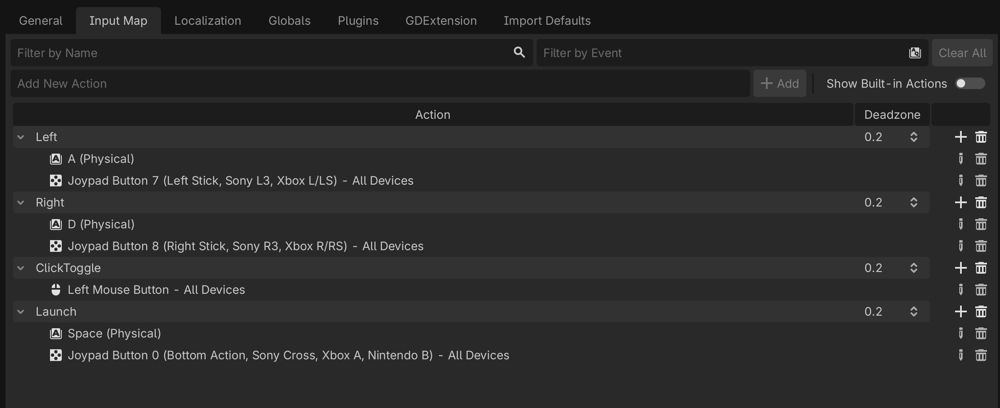

# arkanoid-game-mad2
A basic arkanoid game development with Godot and C#

## Input Map 
### Actions & Bindings
**MoveLeft**
- Keyboard: `A`, `Left Arrow`
- Gamepad: Left stick 

**MoveRight**
- Keyboard: `D`, `Right Arrow`
- Gamepad: Left stick 

**LaunchBall**
- Keyboard: `Space`
- Gamepad: South button 

### Mouse Control

Left-click toggles between keyboard/gamepad control and mouse-follow control. When mouse control is active, the paddle follows the mouse's X position.

